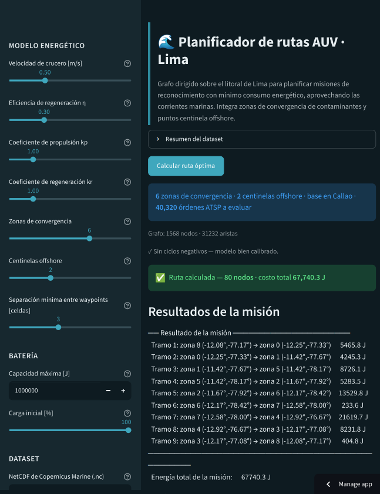
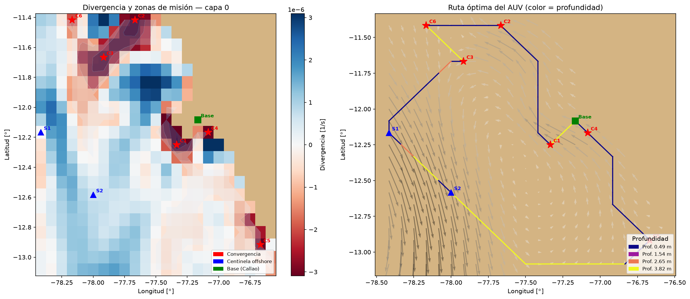
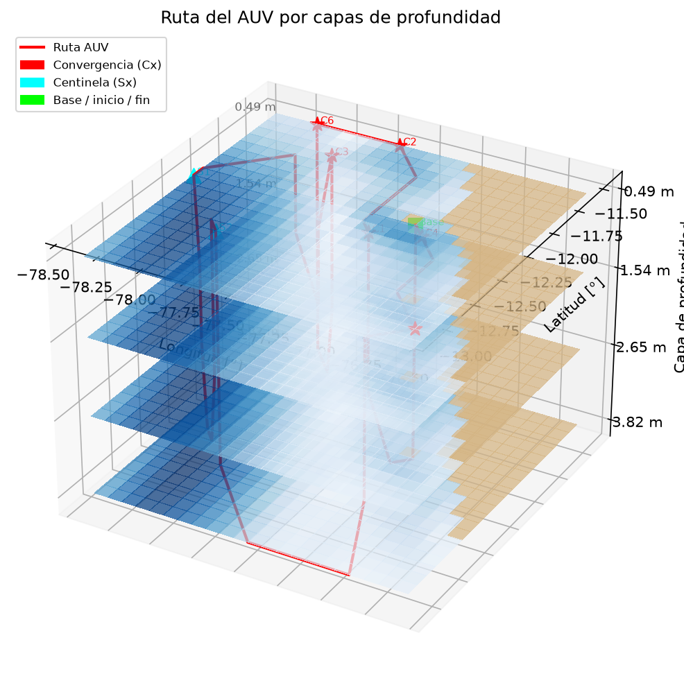
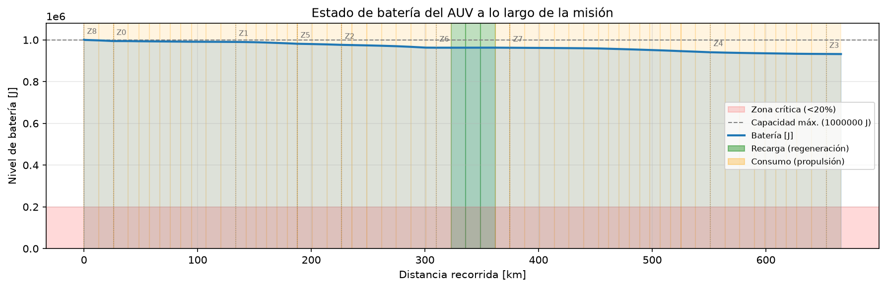

# 🌊 Planificador de rutas AUV — Lima

Planificador de **rutas de mínima energía** para un Vehículo Submarino Autónomo
(AUV) que realiza misiones de reconocimiento en el litoral de Lima-Callao,
aprovechando las corrientes marinas para gastar la menor cantidad de batería
posible.

El mar se modela como un **grafo dirigido y asimétrico**: cada celda navegable
es un nodo y el peso de cada arista es la *energía neta* de desplazamiento.
Moverse a favor de la corriente es barato (incluso puede regenerar energía);
moverse en contra es caro — de ahí que el grafo sea asimétrico. Sobre ese
modelo se calculan las rutas de mínimo consumo con **Bellman-Ford** y el orden
óptimo de visita con un **ATSP por enumeración exacta**.



---

## ¿Cómo funciona?

El problema se resuelve en dos capas:

1. **Rutas de mínima energía (Bellman-Ford).** Entre cada par de zonas se busca
   el camino de menor energía neta. Se usa Bellman-Ford —y no Dijkstra— porque
   las aristas pueden tener **peso negativo**: cuando la corriente empuja al
   AUV, el tramo *recupera* energía.
2. **Orden óptimo de visita (ATSP).** Con los costos mínimo entre todas las
   zonas se arma una matriz y se resuelve el **Problema del Viajante Asimétrico**
   por fuerza bruta, obteniendo el recorrido completo de menor consumo que parte
   y regresa a la base en el Callao.

Las **zonas de interés** no se eligen a mano: se derivan del propio campo de
corrientes mediante la **divergencia horizontal**. Donde el flujo converge, los
contaminantes se acumulan, así que esas celdas se vuelven los waypoints de la
misión. Se complementan con **centinelas offshore** para detección temprana de
derrames en mar abierto.

El modelo es determinista (RNF-05): los mismos parámetros producen siempre el
mismo resultado, y antes de planificar se **verifica la ausencia de ciclos de
energía negativa**, que delatarían una mala calibración (un AUV que ganara carga
dando vueltas).

---

## Características

- **Interfaz web interactiva** (Streamlit) con tema marino y **modo claro/oscuro**.
- Carga del campo de corrientes desde **NetCDF de Copernicus Marine (CMEMS)**,
  con dataset de ejemplo incluido y tolerancia a las variantes de nombres de
  variables de los distintos productos CMEMS.
- Parámetros del modelo energético ajustables en vivo: velocidad de crucero,
  eficiencia de regeneración, coeficientes de propulsión y regeneración, número
  de zonas y centinelas, separación mínima entre waypoints y batería.
- **Métricas de misión**: energía total, consumida, regenerada y batería mínima
  alcanzada, con aviso si la carga no alcanza para completar el recorrido.
- **Visualizaciones**: zonas y divergencia, ruta 2D, ruta 3D por capas y perfil
  de batería, todas descargables en PNG.
- Detalle de **energía por tramo** y **exportación de la ruta a CSV**.

| Ruta 2D | Vista 3D por capas | Perfil de batería |
|:---:|:---:|:---:|
|  |  |  |

---

## Estructura

```
tf-auv-ruta/
├── .streamlit/
│   └── config.toml      tema visual (claro/oscuro)
├── data/                dataset NetCDF de corrientes (CMEMS)
├── src/                 núcleo modular
│   ├── config.py        parámetros del modelo (dataclass inmutable)
│   ├── datos.py         carga del NetCDF y máscara de tierra      (RF-01, RF-02)
│   ├── grafo.py         grafo dirigido + función de costo         (RF-03, RF-04)
│   ├── zonas.py         divergencia y selección de waypoints      (RF-05 a RF-07)
│   ├── algoritmos.py    Bellman-Ford, matriz de costos y ATSP     (RF-08, RF-09)
│   ├── metricas.py      energía total, costos y exportación       (RF-12, RF-13)
│   └── visualizacion.py plots de matplotlib                       (RF-11)
├── app.py               interfaz Streamlit                        (RF-10, RF-11)
├── notebooks/           pruebas visuales durante el desarrollo
├── outputs/             figuras y rutas exportadas
├── tests/               pruebas unitarias
└── informe/             informe técnico (Typst → PDF)
```

Cada módulo traza a un grupo de requisitos, como evidencia del diseño modular
(RNF-08). Las dependencias fluyen en una sola dirección: **el núcleo nunca
depende de la interfaz**, de modo que la UI puede cambiarse sin tocar la lógica.

---

## Instalación y ejecución

Requiere **Python 3.10+** y **Streamlit ≥ 1.45** (para el modo claro/oscuro).

```bash
pip install -r requirements.txt

streamlit run app.py    # interfaz web
pytest                  # pruebas
```

Al abrir la app se usa el dataset de ejemplo (`data/lima3.nc`); también podés
subir tu propio NetCDF de CMEMS desde la barra lateral. El tema se alterna entre
claro y oscuro desde el menú **☰ → Settings → Theme** (o sigue al del sistema).

---

## Documentación

El **informe técnico completo** —fundamentos del modelo energético, decisiones
de diseño, validación y resultados— está disponible como PDF:

**📄 [Abrir informe completo (PDF · 16 páginas)](informe/main.pdf)**

Las fuentes del informe están escritas en [Typst](https://typst.app/)
(`informe/main.typ` y la plantilla `informe/upc.typ`).
